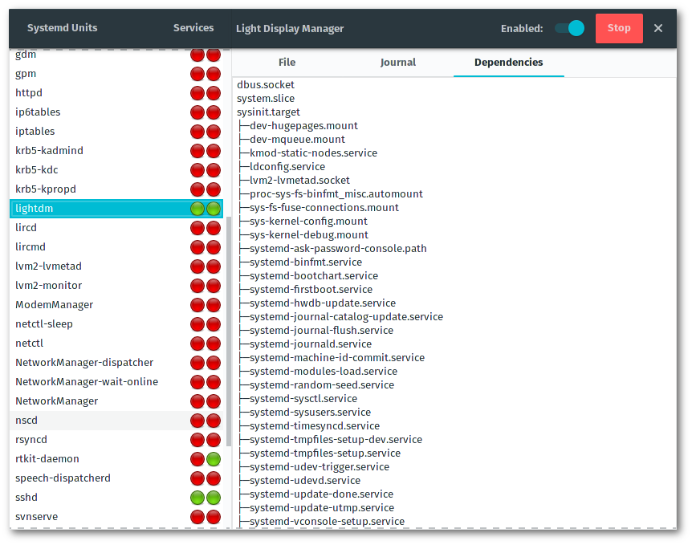
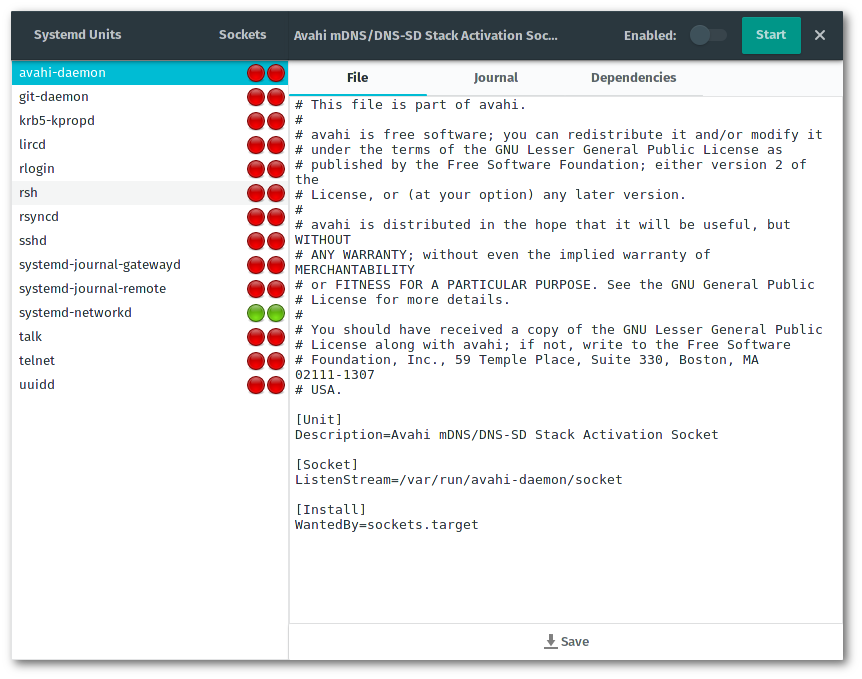
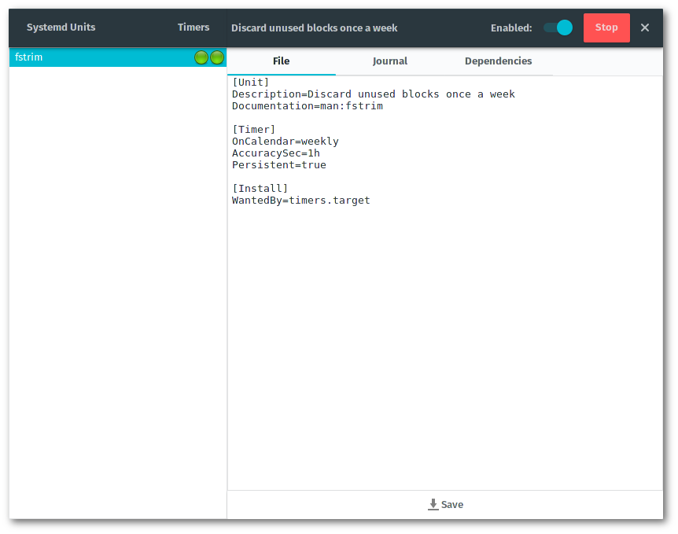
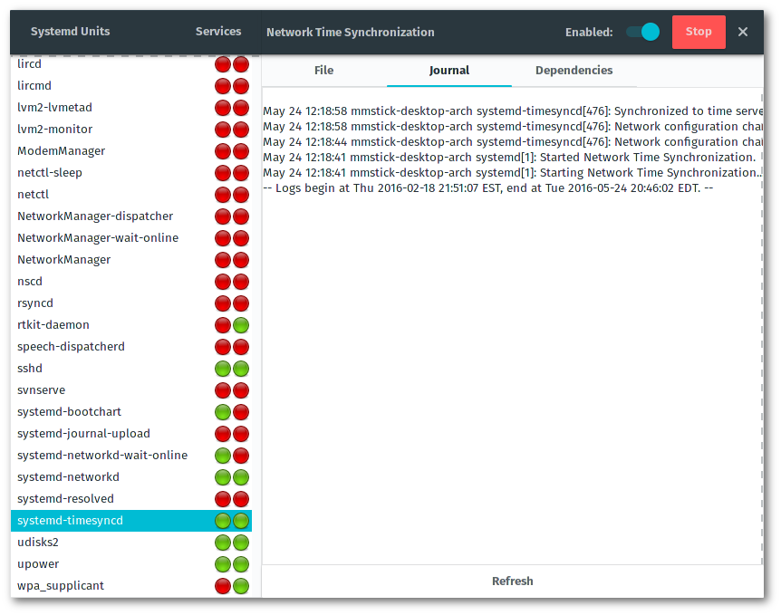
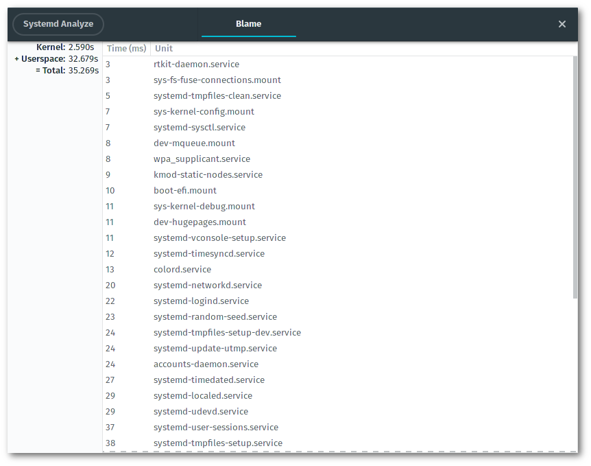

**Build Status:** [](https://travis-ci.org/mmstick/systemd-manager)

# Systemd Manager

This application exists to allow the user to manage their systemd services via a GTK3 GUI. Not only are you able to make changes to the enablement and running status of each of the units, but you will also be able to view and modify their unit files, check the journal logs. In addition, systemd analyze support is available to display the time it takes for systemd to boot the system.

## Screenshots











## Install Instructions

### Arch Linux

This is available in the AUR as a git package: [`systemd-manager-git`](https://aur.archlinux.org/packages/systemd-manager-git/).

### Ubuntu

Simply run this in a terminal to `wget` the Debian package and `dpkg -i` it.

```sh
wget https://github.com/mmstick/systemd-manager/releases/download/0.4.5/systemd-manager_0.4.5_amd64.deb
sudo dpkg -i systemd-manager_0.4.5_amd64.deb
```

### Building From Source

For Ubuntu users, this will automatically install `libgtk-3-dev`, generate a systemd-manager Debian package and automatically install it.

```sh
make ubuntu
```

For everyone else, this will simply install directly to the /usr prefix. Simply install Rust via [rustup.rs](https://www.rustup.rs/) and execute `make & sudo make install`. The installation of Rust software is incredibly simple as the process is largely just `cargo build --release`, but this installation script will install all the files needed by the application for proper integration with **PolicyKit** into the correct places in the filesystem, which `cargo install` does not perform.

```sh
make && sudo make install
```

In the event that you would like to uninstall the application, simply run the following:

```sh
sudo make uninstall
```
